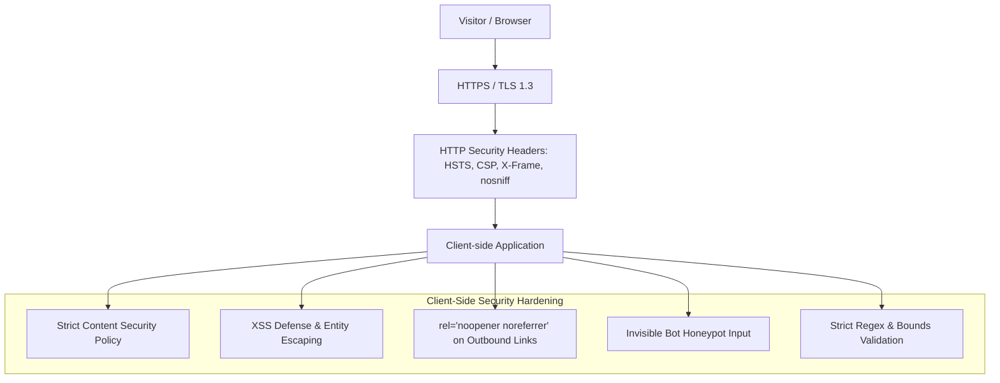

# Codebase Architecture, Functionality & Progress Documentation
**Project:** David Ogbogu — Senior Data Analyst & Digital Product Designer Portfolio Website  
**Owner / Profile:** David Ogbogu  
**Email:** davidogbogu2005@gmail.com  
**Location:** Enugu State, Nigeria (Available for Global Remote Opportunities)  
**Last Updated:** August 24, 2026  
**Security Status:** 🛡️ Grade A+ (Production-Ready)  

---

## 1. Executive Summary & Core Objective

This codebase is a high-performance, single-page, responsive, and interactive personal portfolio website built for **David Ogbogu**, who is primarily a **Senior Data Analyst & Analytics Engineer** and additionally specializes in **Web & App Product Design**.

The website combines:
- Quantitative rigor (predictive machine learning modeling, SQL/Snowflake engineering, time-series telemetry, Monte Carlo simulations).
- Premium editorial UI/UX aesthetics inspired by the **Alexfolio** design framework (floating pill navigation, continuous infinite marquee ticker, rounded cards with corner arrow links `↗`, high contrast, and smooth micro-interactions).
- Continuous **60 FPS moving interactive data visualizations** (live canvas waveforms, animated energy particles, and real-time streaming hospital telemetry).
- Hardened client-side security architecture (zero external JS dependencies, strict CSP/HSTS header configurations, honeypot anti-spam defense, and XSS sanitization).

---

## 2. Directory & File Structure

```
Website-demo-1/
├── index.html                   # Core semantic HTML5 structure, SEO tags, ARIA accessibility, & section layouts
├── server.js                    # Zero-dependency local Node.js static HTTP development server
├── README.md                    # Project run guide and technology summary
├── ARCHITECTURE.md              # Living architecture, functionality & progress tracker (this document)
├── SECURITY_AUDIT.md            # Full security & compliance audit report
├── _headers                     # Production HTTP security headers configuration (Netlify / Cloudflare)
├── vercel.json                  # Production HTTP security headers configuration (Vercel)
├── .agents/
│   └── rules/
│       └── always_update_architecture.md # Agent instruction rule to maintain this documentation
└── assets/
    ├── css/
    │   ├── main.css             # Design tokens, CSS variables, typography, reset, grids, and themes
    │   ├── components.css       # Floating nav, hero, marquee, cards, buttons, timeline, modals, forms & footer
    │   └── animations.css       # Keyframes (marquee, float, pulses, 60fps loops, reveals)
    ├── js/
    │   ├── main.js              # Theme manager, scrollspy, mobile drawer, estimators, forms & toast alerts
    │   ├── charts.js            # Continuous 60fps canvas charting engine & interactive simulation models
    │   ├── experience.js        # Career history data store & interactive chronological roadmap filters
    │   └── projects.js          # Project catalog data & deep-dive case study modal dialog controller
    └── images/
        ├── designer-portrait.jpg# Main photo of David Ogbogu with ambient glow framing
        ├── data-dashboard.jpg   # Light-mode enterprise retention & predictive churn analytics mockup
        ├── data-healthcare.jpg  # Light-mode hospital patient flow & capacity telemetry dashboard mockup
        ├── app-finpulse.jpg     # Light-mode FinPulse AI wealth manager mobile/web app mockup
        ├── app-omni.jpg         # Light-mode OmniMetrics real-time SaaS telemetry web app mockup
        └── design-nexus.jpg     # Nexus design system atomic component library mockup
```

---

## 3. Technology Stack & Design System

| Layer | Technology / Standard | Implementation Details |
| :--- | :--- | :--- |
| **Markup** | HTML5 (Semantic) | Descriptive semantic tags (`<header>`, `<nav>`, `<section>`, `<article>`, `<aside>`, `<footer>`), OpenGraph metadata, JSON/SVG icons, and WCAG 2.1 AA accessible ARIA attributes. |
| **Styling** | Vanilla CSS3 (Custom Tokens) | CSS custom properties for instant light/dark theme switching, Flexbox, responsive CSS Grid, glassmorphism (`backdrop-filter: blur()`), and fluid typography. |
| **Typography** | Google Fonts | Primary Heading: `Outfit` (800/900 weight), Body Sans: `Plus Jakarta Sans`, Monospace: `JetBrains Mono`. Preconnected with CORS. |
| **Interactive Logic** | Vanilla JavaScript (ES6+ Modular) | Hardware-accelerated 2D Canvas engine (`requestAnimationFrame`), IntersectionObserver API for scroll animations, state-driven filtering, and modal focus management. Zero bloated dependencies. |
| **Local Dev Server** | Node.js `http` Module (`server.js`) | Lightweight, zero-dependency static HTTP server with full MIME-type routing and security path normalization. |
| **Security & Headers** | CSP & Modern HTTP Headers | Strict HSTS, X-Content-Type-Options `nosniff`, X-Frame-Options `SAMEORIGIN`, Referrer-Policy, Honeypot bot protection, and sanitized DOM insertion. |
| **Assets** | Web-optimized JPEGs / SVGs | High-resolution light-mode interfaces and portrait photos with zero broken links. |

---

## 4. Section-by-Section Functionality Breakdown

### 4.1 Floating Pill Navigation (`site-header`)
- **Structure**: Floating rounded pill container centered at `top: 18px` with blurred glassmorphism.
- **Scrollspy**: Highlights the active section dynamically as the user scrolls.
- **Theme Toggle**: Dual-mode switcher (Dark Mode default / Light Mode) persisting preference in `localStorage`.
- **Mobile Drawer**: Responsive slide-down navigation drawer for mobile and tablet devices with animated hamburger toggle.

### 4.2 Hero & Professional Identity (`#hero`)
- **Designer Portrait**: Dedicated display for David Ogbogu's photo with ambient lighting glow, rounded frame (`border-radius: 32px`), and floating metric badges (*99.4% Model Precision*, *8+ Years BI & UX Leadership*).
- **Status Badge**: Pulsing live status indicator (*Available for Senior Analytics & Product Roles*).
- **Live Number Counter**: Real-time ticker counting up key career KPIs ($14.2M+ Revenue Impact, 65+ Production BI Dashboards/Models, 45M+ Daily Telemetry Records, 34% Avg Conversion Uplift).
- **Action CTAs**: Quick buttons to scroll directly to Data Projects, App Projects, or trigger simulated CV download.

### 4.3 Infinite Marquee Ribbon (`.marquee-ribbon`)
- **Visuals**: Seamless, continuous linear scrolling ticker spanning full viewport width.
- **Keywords**: `PREDICTIVE ML MODELING • SNOWFLAKE & DBT PIPELINES • TIME-SERIES TELEMETRY • INTERACTIVE CANVAS VISUALIZATIONS • FIGMA DESIGN SYSTEMS • FULL-STACK REACT APPS • MULTI-TOUCH ATTRIBUTION • STOCHASTIC MONTE CARLO`.

### 4.4 Work Experience Roadmap (`#experience`)
- **Interactive Role Filter Tabs**: Filter timeline entries in real-time between **All Roles**, **Data & BI Roles**, and **Product & UX Roles**.
- **Timeline Items**: Chronological cards featuring role title, company name (*Quantis Intelligence Labs*, *Verve Technologies*, *Studio Helix*, *Acro Data*), time period, detailed bullet achievements, KPI callout boxes, and technical stack badges.

### 4.5 Data Analysis Projects & Continuous Moving Sandbox (`#data-projects`) — *Primary Core Focus*
- **Specialization Banner**: Dedicated highlight banner emphasizing David's primary domain in quantitative analytics, machine learning, and data engineering.
- **Live Moving Canvas Simulator (60 FPS)**:
  1. **Predictive Churn & LTV Simulator**:
     - Continuous streaming sine/spline survival curves showing cohort decay over 12 months.
     - Interactive sliders for *Baseline Retention %* and *ML Feature Adoption Lift %* that smoothly morph the curves and recalculate simulated user LTV and annual savings.
     - Animated particle scan node traveling along the active survival line with a pulsing glow ring.
  2. **Multi-Touch Attribution Engine**:
     - Dynamic bar graph comparing *Shapley Game Theory (Data-Driven)*, *7-Day Time Decay*, *Linear*, and *First-Touch* attribution models.
     - Flowing animated energy particles moving continuously across channel pipelines (Paid Search, Organic, Paid Social, Email CRM, Referral).
  3. **Streaming Hospital Telemetry Oscilloscope**:
     - Continuous real-time moving medical influx stream with moving scanline sweeps and threshold monitors.
     - Live anomaly spike alerts triggering automatic color changes and badge warnings.
- **Data Project Cards (Light Mode Mockups)**:
  - *Predictive Churn Engine & Retention Dashboard* ($3.2M ARR Preserved, 38.4% Churn Reduction, 0.94 AUC-ROC).
  - *Healthcare Patient Flow & Capacity Forecasting* (-42 min ER Wait Time, 96.2% Bed Allocation Accuracy, 250K+ Patients Served).
  - Includes corner arrow links `↗` and case study deep-dive triggers.

### 4.6 App Projects Showcase (`#app-projects`)
- **FinPulse**: AI Wealth Intelligence & Cashflow Cockpit (Light-mode UI, NLP heuristics, Monte Carlo net worth forecasting, client-side AES-256 encryption).
- **OmniMetrics**: Real-Time SaaS Telemetry Engine (Light-mode UI, WebSockets 10K evt/sec, conversion funnel nodes, 60fps canvas charts).
- Interactive modals displaying system architecture and technical features.

### 4.7 Design Projects & Design Systems (`#design-projects`)
- **Nexus Design System**: Enterprise Data Visualization Kit (140+ atomic components, 380+ design tokens, 100% WCAG 2.1 AA compliant color ramps, multi-brand Figma library).

### 4.8 Technical Skills Matrix (`#skills`)
- Animated progress bars triggered by scroll intersection observer:
  - **Data & Analytics**: SQL & Snowflake / BigQuery (98%), Python (95%), Tableau & Power BI (92%), Cohort Modeling (94%).
  - **UI/UX & Product Design**: Figma & Design Systems (94%), Information Architecture (90%), Data Viz UI Design (96%), Usability Testing (88%).
  - **App Development & Frontend**: JavaScript & TypeScript (92%), React & Next.js (89%), Canvas API & SVG (91%), REST APIs & Node.js (86%).

### 4.9 Interactive Contact & Project Scope Estimator (`#contact`)
- **Direct Details**:
  - Email: `davidogbogu2005@gmail.com`
  - Response Time: `Within 24 Business Hours`
  - Location: `Enugu State, Nigeria (Available for Global Remote)`
  - Profiles: LinkedIn, GitHub, Kaggle, Dribbble.
- **Security & Bot Defense**:
  - Hidden honeypot input field (`#form-botcheck`) to trap automated spam bots.
  - Character length constraints (`maxlength`) and regex email validation.
- **Interactive Scope Estimator**: Live estimate calculator toggling between *BI & Dashboarding*, *ML / Predictive Model*, *UI/UX Design System*, and *Full-Stack Data App* with instant price & schedule estimates.

### 4.10 Professional Redesigned Footer (`site-footer`)
- **Top Footer Content**: Brand identity and navigation links with floating back-to-top button.
- **Bottom Footer Bar**:
  - Left: `© 2026 David Ogbogu. All rights reserved.`
  - Center: `Data Analytics • Machine Learning • Product & UI/UX Design`
  - Right: `Enugu State, Nigeria • Open to Remote Worldwide` (with live green status indicator).

### 4.11 Modal Dialog System (`#project-modal-backdrop`)
- Tabbed case study inspection with Problem & Context, Solution Strategy, Methodology, syntax-highlighted SQL / Python code snippets, and Measurable Business Impact.
- Code blocks sanitized via `escapeHTML()`.
- Accessibility: Focus trapping, backdrop dismissal, ESC key listener, and background body scroll locking.

---

## 5. Security & Compliance Architecture



---

## 6. Progress & Version Changelog

| Date | Version | Key Changes & Milestones |
| :--- | :--- | :--- |
| **2026-08-23** | `v1.0.0` | Initial architecture setup with semantic HTML5, Vanilla CSS3, custom canvas charts, project modals, and experience roadmap. |
| **2026-08-23** | `v1.1.0` | Implemented **Alexfolio** design framework (floating pill nav, infinite marquee ticker, rounded cards with corner arrow `↗` links), integrated user's uploaded portrait, removed star emojis, and upgraded charts to continuous 60fps animations. |
| **2026-08-23** | `v1.2.0` | Rebranded owner identity to **David Ogbogu**, generated and replaced 4 project mockups with high-contrast **light mode UI images**, updated direct contact to **`davidogbogu2005@gmail.com`**, updated location to **`Enugu State, Nigeria`**, and redesigned the footer to a professional 3-part layout. |
| **2026-08-23** | `v1.3.0` | Established living `ARCHITECTURE.md` documentation and automated agent rule to continuously track all codebase, architecture, and feature changes. |
| **2026-08-23** | `v1.4.0` | Completed full security & compliance audit (`SECURITY_AUDIT.md`), created `_headers` and `vercel.json` production security header configurations, hardened DOM insertion against XSS in `showToast()`, added honeypot bot defense and field validation constraints. |
| **2026-08-24** | `v1.5.0` | Created zero-dependency Node.js HTTP development server (`server.js`) with full MIME routing and launched local live instance at `http://localhost:3000`. |

---

## 7. How to Maintain & Update This Document

> [!IMPORTANT]
> Whenever any code, styling, script, image asset, or architectural change is introduced to the repository, **`ARCHITECTURE.md` must be updated immediately** to reflect:
> 1. Any file modifications, additions, or deletions.
> 2. Functional or behavioral changes.
> 3. New entries in the Version Changelog table.
